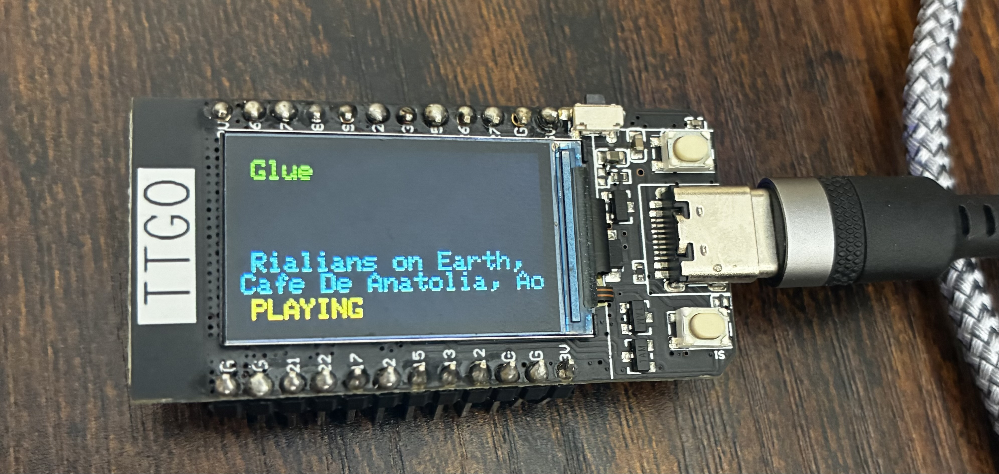

# Spotify for ESP32 TTGO T-Display

This example turns an ESP32 TTGO T-Display into a small Spotify now-playing screen. It connects to Wi-Fi, authenticates with your Spotify account, and shows the current track, artist names, and playback status on the built-in 240 × 135 display in landscape orientation. Music plays on your Spotify playback device; the ESP32 displays its status.

This project is based on [mauringo/SpotifyEsp32_fixedAuthReboot](https://github.com/mauringo/SpotifyEsp32_fixedAuthReboot) and uses that library with Arduino, PlatformIO, and TFT_eSPI.



*The example running on a TTGO T-Display: track title at the top, artist names below, and playback status along the bottom.*

## What the example does

- Connects to the configured Wi-Fi network and synchronizes the clock using NTP before Spotify authentication.
- Starts browser authorization on first use and saves the Spotify refresh token in the ESP32’s nonvolatile storage, so it can reuse the login after a restart.
- Polls playback status, artist names, and track title, with a one-second delay between polling cycles. Network requests add to the update interval.
- Shows the track title in green, artist names in cyan, and `PLAYING` in yellow or `PAUSED` in red.
- Keeps the last valid track and artist visible when playback pauses, stops, or a metadata request returns invalid data. Before valid metadata is available, it shows a simple `Playing` or `Paused` message.
- Automatically restarts after approximately 55 minutes of the main loop, then reconnects using the saved login. If the saved refresh token fails during startup, it clears the token and restarts to request a new browser login.

The display uses fixed-size text; long titles or artist lists can wrap or be clipped. This example implements a status display, with button-based playback controls and no audio output.

## Button controls

- **S1 (GPIO0):** toggles Spotify playback between pause and play.
- **S2 (GPIO35):** skips to the next song.

Each press sends one command; holding a button does not repeat it. Buttons become active after Spotify login. Commands wait for any Spotify request already in progress, and the display refreshes after a command. The GPIO mapping is for the [original TTGO T-Display](https://wiki.lilygo.cc/products/t-display-series/t-display/).

Start playback on your phone, computer, or another Spotify device first. These controls require Spotify Premium and the `user-modify-playback-state` permission, as described in the [Spotify playback API documentation](https://developer.spotify.com/documentation/web-api/reference/skip-users-playback-to-next-track). If your saved login lacks that permission, repeat browser authorization using `FORCE_NEW_LOGIN` as described below. Command HTTP status codes are printed in the serial monitor for troubleshooting.

## Setup

1. Open this project in PlatformIO and connect an ESP32 TTGO T-Display over USB.
2. Copy `include/secrets.h.example` to `include/secrets.h` and enter your Wi-Fi SSID/password and Spotify application client ID/secret. The local credentials file is ignored by Git.
3. Follow the [base library’s authentication setup](https://github.com/mauringo/SpotifyEsp32_fixedAuthReboot) for your Spotify application.
4. Build and upload the firmware:

   ```sh
   pio run
   pio run --target upload
   ```

5. Open the serial monitor at 115200 baud:

   ```sh
   pio device monitor
   ```

6. On first use, follow the authentication URL/instructions in the serial output and complete Spotify authorization in your browser. Start Spotify playback on your playback device to see the track information on the display.

To force a new login, set `FORCE_NEW_LOGIN` to `true` in `src/main.cpp` and upload once. Set it back to `false` and upload again after authorizing so subsequent restarts retain the saved login. The automatic restart interval is controlled by `REBOOT_INTERVAL_MS`.

The active firmware is in `src/main.cpp`; display pins, board settings, and library dependencies are configured in `platformio.ini`.
